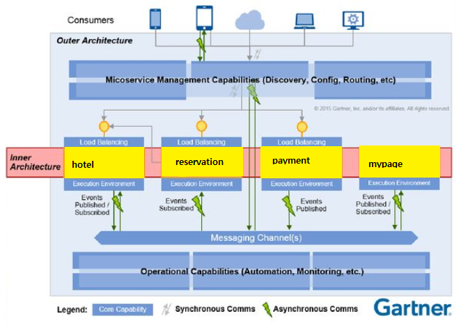

# 클라우드 네이티브 Final Project

## 클라우드 네이티브 아키텍처(IaaS)



## Before Running Services
### Make sure there is a Kafka server running
```
cd kafka
docker-compose up
```
- Check the Kafka messages:
```
cd infra
docker-compose exec -it kafka /bin/bash
cd /bin
./kafka-console-consumer --bootstrap-server localhost:9092 --topic
```

## Run the backend micro-services
See the README.md files inside the each microservices directory:

- hotel
- reservation
- payment
- mypage
- notification


## Run API Gateway (Spring Gateway)
```
cd gateway
mvn spring-boot:run
```

## Test by API
- hotel
```
 http :8088/hotels id="id" roomCount="roomCount" hotelName="hotelName" status="status" 
```
- reservation
```
 http :8088/hotelReservations id="id" reservationId="reservationId" userId="userId" status="status" roomCount="roomCount" startDate="startDate" endDate="endDate" price="price" hotelName="hotelName" address="address" roomNumber="roomNumber" 
```
- payment
```
 http :8088/payments id="id" reservationId="reservationId" status="status" price="price" hotelName="hotelName" payDt="payDt" 
```
- mypage
```
```
- notification
```
```


## Run the frontend
```
cd frontend
npm i
npm run serve
```

## Test by UI
Open a browser to localhost:8088

## Required Utilities

- httpie (alternative for curl / POSTMAN) and network utils
```
sudo apt-get update
sudo apt-get install net-tools
sudo apt install iputils-ping
pip install httpie
```

- kubernetes utilities (kubectl)
```
curl -LO "https://dl.k8s.io/release/$(curl -L -s https://dl.k8s.io/release/stable.txt)/bin/linux/amd64/kubectl"
sudo install -o root -g root -m 0755 kubectl /usr/local/bin/kubectl
```

- aws cli (aws)
```
curl "https://awscli.amazonaws.com/awscli-exe-linux-x86_64.zip" -o "awscliv2.zip"
unzip awscliv2.zip
sudo ./aws/install
```

- eksctl 
```
curl --silent --location "https://github.com/weaveworks/eksctl/releases/latest/download/eksctl_$(uname -s)_amd64.tar.gz" | tar xz -C /tmp
sudo mv /tmp/eksctl /usr/local/bin
```

